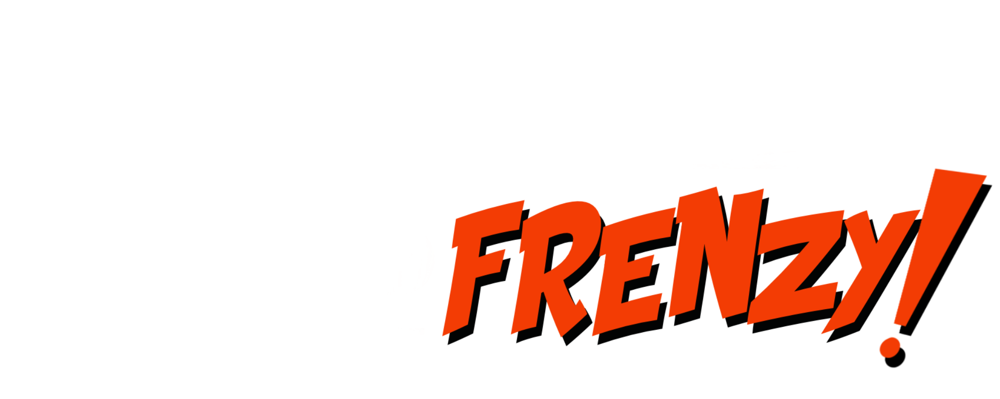
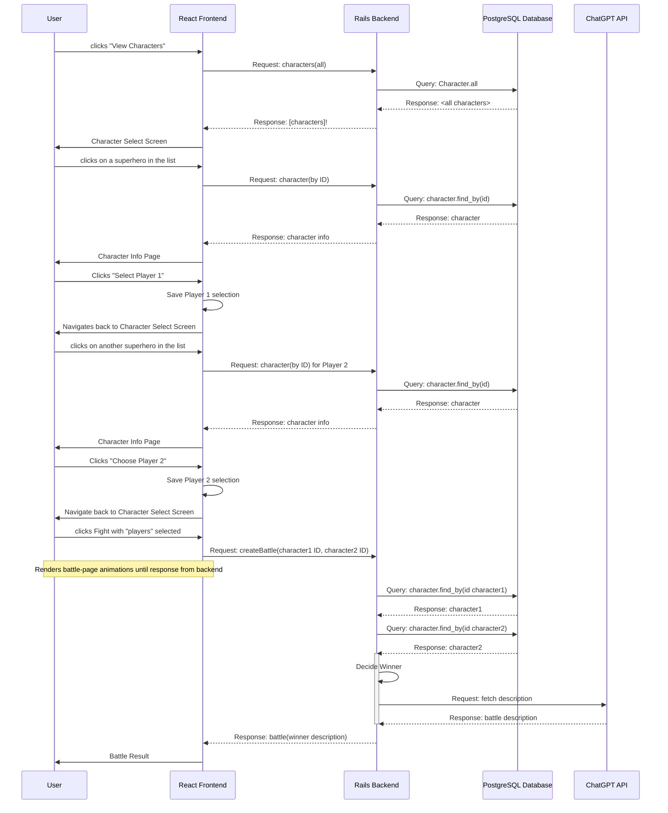

# Fictional-Feud-Frenzy (Front end Repo)


## About This Project
### Important to Note
This is an SOA app and needs both this repo (front end) AND [](https://github.com/Fictional-Feud-Frenzy/FFF-BE) (back end) in order to be fully functioning.


### Overview
This project is built to satisfy the requirements of the Turing School of Software and Design's [Capstone Project](https://mod4.turing.edu/projects/capstone/). Students come up with their own idea for an application and build it as a group project. Front end students and Back end students work together to simulate working on a full stack team


                    
## Purpose

The purpose of the frontend for the FFF app is to support the overall functionality and effectiveness of the backend application. Here are some key purposes of the front end in relation to the project:

<b><u>Data management:</u></b> The Frontend serves as the central hub for selecting, filtering, and displaying the data associated with characters and fight logic for the backend

<b><u>Flexible Data Retrieval:</u></b> GraphQL allows the frontend to request exactly the data they need and nothing more

Overall, the purpose of the front end in the Fictional-Feud_Frenzy app is to support seamless data management and AI story prompts. It plays a vital role in ensuring the app's functionality and user satisfaction, ultimately enhancing the daily lives of its users.

## Technologies Used
- React
- Router
- JavaScript (ES6)
- CSS
- HTML
- Cypress
- GraphQL
- Vercel Deployment
- CircleCI testing 
- AI


## Running On
  - [Vercel](https://fff-fe.vercel.app/)

## <b>Getting Started</b>

To get a local copy, follow these simple instructions

### <b>Installation</b>

1. Fork the Project
2. Clone the repo 
``` 
git clone git@github.com:your_username/Fictional-Feud-Frenzy/FFF-FE.git
```
3. Install NPM
```
npm install
```
4. Start The App
```
npm start
```

5. Get API key from OpenAI<br>
[](https://platform.openai.com/)<br>

## App Workflow



## BE Schema
```
create_table "characters", force: :cascade do |t|
  t.string "name"
  t.integer "intelligence"
  t.integer "strength"
  t.integer "speed"
  t.integer "durability"
  t.integer "power"
  t.integer "combat"
  t.string "full_name"
  t.string "place_of_birth"
  t.string "publisher"
  t.string "alignment"
  t.string "gender"
  t.string "race"
  t.string "height"
  t.string "weight"
  t.string "eye_color"
  t.string "hair_color"
  t.string "group_affiliation"
  t.string "image"
  t.datetime "created_at", null: false
  t.datetime "updated_at", null: false
  t.float "power_stats_weighted_average"
end

create_table "battles", force: :cascade do |t|
  t.bigint "character1_id", null: false
  t.bigint "character2_id", null: false
  t.bigint "winner_id", null: false
  t.text "description"
  t.datetime "created_at", null: false
  t.datetime "updated_at", null: false
  t.index ["character1_id"], name: "index_battles_on_character1_id"
  t.index ["character2_id"], name: "index_battles_on_character2_id"
  t.index ["winner_id"], name: "index_battles_on_winner_id"
end
```

## Contributing  [](https://github.com/Fictional-Feud-Frenzy/FFF-BE/issues)
Contributions are what make the open source community such an amazing place to learn, inspire, and create. Any contributions you make are **greatly appreciated**.

## Thoughts for future contributions:


If you have a suggestion that would make this better, please fork the repo and create a pull request. You can also simply open an issue with the tag "enhancement".
Don't forget to give the project a star! Thanks again!

## API's Used
[](https://platform.openai.com/)<br>
Chuck Norris API: https://api.chucknorris.io </br>
Superhero API: https://superheroapi.com


## FFF TEAM


- Jeff Nelson [ ](https://github.com/jpnelson85) [ ](https://www.linkedin.com/in/jeff-nelson-307aba45/)
- Christopher Cullinane [ ](https://github.com/topher-nullset) [ ](https://www.linkedin.com/in/chris-cullinane-be/)
- Nick Sacco [ ](https://github.com/sicknacco) [ ](https://www.linkedin.com/in/nick-sacco/)
- Bradley Milton [ ](https://github.com/brad2412) [ ](https://www.linkedin.com/in/bradley-milton-01a814132/)
- Ben Holden [ ](https://github.com/BenHolden010) [ ](https://www.linkedin.com/in/ben-holden-5115b8183)
- Denzel Turambi [ ](https://github.com/Denzel-Turambi) [ ](https://www.linkedin.com/in/denzel-turambi-71a298267/)

## Planning Tools
</br>
[ ](https://github.com/orgs/Fictional-Feud-Frenzy/projects/1)</br>

